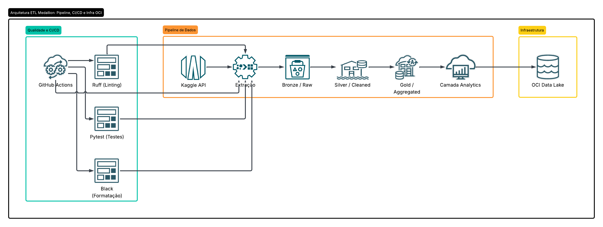

# IMDB Medallion ETL Pipeline 🎬

[](https://github.com/RenatoGregorio01/imdb-medallion-etl/actions/workflows/ci.yml)

Este projeto implementa um pipeline de dados **ponta a ponta (E2E)** para processar informações do IMDB, utilizando a **Arquitetura Medallion**. O projeto foca em alta qualidade, governança e automação, garantindo que os dados sejam validados e persistidos na nuvem de forma estruturada.

## 🏗️ Arquitetura do Projeto

<div align="center">
  
</div>

## 🚀 Sobre o Pipeline (Medallion Architecture)
O processamento é dividido em camadas lógicas para garantir a integridade e utilidade dos dados:

* **Bronze (Raw):** Ingestão dos dados brutos do Kaggle via API, armazenados sem transformações.
* **Silver (Cleaned):** Limpeza, tratamento de nulos, padronização de tipos e eliminação de duplicatas.
* **Gold (Aggregated):** Dados enriquecidos e agregados, servindo como a "fonte da verdade".
* **Analytics:** Tabelas finais de insight prontas para consumo de negócio.

## 🛠️ Tecnologias e Governança
* **Orquestração e CI/CD:** GitHub Actions (Linting, Formatação e Testes automatizados).
* **Qualidade de Código:** 
    * **Ruff:** Verificação de padrões de código (Linting).
    * **Black:** Padronização visual (Formatação).
    * **Pytest:** Testes unitários para validar a lógica de transformação.
* **Infraestrutura:** Oracle Cloud Infrastructure (OCI) Object Storage.
* **Linguagem:** Python 3.12+.

---

## 🛠️ Como rodar localmente

### 1. Pré-requisitos
* Conta no [Kaggle](https://www.kaggle.com/): Gere um **API Token** em suas configurações e salve o `kaggle.json` em `~/.kaggle/`.

### 2. Preparação do Ambiente
```bash
git clone git@github.com:RenatoGregorio01/imdb-medallion-etl.git
cd imdb-medallion-etl

# Crie e ative o ambiente virtual
python -m venv venv
source venv/bin/activate  # Windows: venv\Scripts\activate

# Instale as dependências
pip install -r requirements.txt
```
### 3. Execução do Pipeline
Para executar todo o fluxo (Extração -> Bronze -> Silver -> Gold -> Analytics) através do ponto de entrada principal:
python -m src.main

#### Orquestração com Airflow (Opcional)
Se desejar rodar o pipeline através do orquestrador, utilize:

docker-compose up -d

> ⚠️ **Aviso Importante: Execução e Infraestrutura OCI**
> 
> O pipeline foi projetado para integrar-se com o **Oracle Cloud Infrastructure (OCI) Object Storage**. 
> 
> * **Requisito de Conexão:** Para que o pipeline complete as etapas de persistência de dados na nuvem, é obrigatória a configuração do arquivo `.env` na raiz do projeto com as suas credenciais válidas da OCI (`TENANCY_ID`, `USER_ID`, `API_KEY`, etc.).
> * **Comportamento sem credenciais:** Caso o pipeline seja executado sem a devida configuração das variáveis de ambiente da OCI, ele processará os dados localmente, porém **falhará na etapa de upload/persistência** no Object Storage.

## 📊 Fonte dos Dados
Os dados utilizados neste projeto foram extraídos do Kaggle. Você pode acessar o dataset original através do link abaixo:
* **Dataset:** [IMDB Top Movies (1980-2026)](https://www.kaggle.com/datasets/elvisbui/imdb-top-movies-1980-2026/data)

## 📁 Estrutura do Repositório
A organização abaixo reflete a estrutura atual do projeto, incluindo os componentes de orquestração com Airflow e configurações de ambiente:

```text
IMDB-MEDALLION-ETL/
├── .github/          # Configurações de GitHub Actions
├── airflow/          # Configurações do Airflow
├── assets/           # Imagens e documentação visual
├── data/             # Dados locais (ignored por padrão)
├── notebooks/        # Jupyter Notebooks para análise exploratória
├── src/              # Código fonte principal
├── tests/            # Testes automatizados (Pytest)
├── .gitignore        # Arquivos ignorados pelo Git
├── Dockerfile        # Configuração de container Docker
├── pyproject.toml    # Configurações de dependências e ferramentas
└── requirements.txt  # Dependências do projeto
```